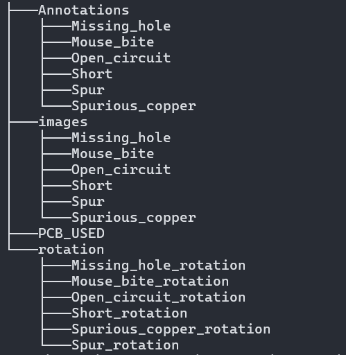

# PCB Dataset
## Introduction to PCBs
The PCB dataset is primarily a dataset of images of Printed Circuit Boards.
Printed Circuit board is the most important element in an electronic device. A great number of elements are placed on the PCB, Hence its quality has a direct impact on the device performance.

## Aim of the dataset
The PCB is a complex device, and it has become increasingly difficult to detect and classify its defects.
This dataset provides a colourized synthesized PCB dataset, with the 6 major defects in PCBs classified for model training.

## Structure
The dataset is divided into 4 part, each part is placed inside a folder. The folders are named Annotations, images, PCB_USED and rotation.

 
- Annotations: This folder contains 6 folders each of which contain XML files for corresponding images.
- images: This folder contains 6 folders with the same names, each of the folders contain images with defects and at the the same position as the templates.
- PCB_USED: This folder contains the 12 template images used in the dataset.
- rotation: This folder conatians 6 folders with rotated images, in addition to that roatation angles are also provided with the image names in text files.

### Annotations
This folder contains XML files for each image. The XML files have information of bounding boxs of each image.

A bounding box is the smallest rectangle enclosing the object of our interest aligned with its orientation. 
For PCB Dataset we are intersted in the defects in an image, hence the bounding boxes enclose the defects. As can be noticed the XML files have multiple object parameters ie: there are multiple bounding boxes for each image, hence one primary conclusion we can draw is that each image has multiple defcts of the same type.

### images
This folder contains the images the model will be trained on. Since this is a classified dataset the images are organized in 6 folders each named as one of the types of defect we aim to classify.

### PCB_USED
This folder containes 12 template images each labelled from 01 to 12. These images have no defects and are aligned perfectly straight.

These images will be used to align and mark defects in the images that the model will be trained on.

### rotation
This folder contains 6 sub-folders and 6 text files. each sub-folder contains of the images from the "images" folder but rotated at a random angle which is noted in the respective text files.

## Defects 
There are 6 defects we are aiming to detect and classify. 
1. Missing hole
2. Mouse bite
3. Open circuit
4. Short
5. Spur
6. Spuriour copper

## Convention
Images , XML flies and text files all follow a naming convention.

For Annotations folder it is (template number) _ (defect type) _ (corresponding image number).xml
For images folder it is (template number) _ (defect type) _ (corresponding image number).jpg
For PCB_USED folder it is (template number).jpg
for rotation folder it is (template number) _ (defect type) _ (corresponding image number).jpg for the images and (defect type)_angles.txt. in addition to that the sub-folders in rotation are named (defect type)_rotation.