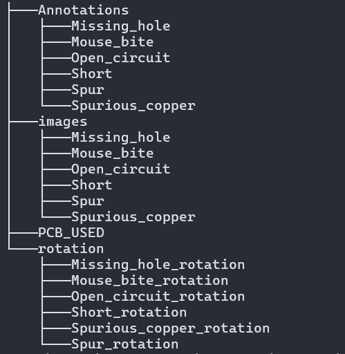

# PCB Dataset
## Introduction to PCBs
The PCB dataset is primarily a dataset of images of Printed Circuit Boards.
Printed Circuit board is the most important element in an electronic device. A great number of elements are placed on the PCB, Hence its quality has a direct impact on the device performance.

## Aim of the dataset
The PCB is a complex device, and it has become increasingly difficult to detect and classify its defects.
This dataset provides a colourized synthesized PCB dataset, with the 6 major defects in PCBs classified for model training.

## Structure
The dataset is divided into 4 part, each part is placed inside a folder. The folders are named Annotations, images, PCB_USED and rotation.

 
- Annotations: This folder contains 6 folders:
    1. Missing_hole
    2. Mouse_bite
    3. Open_circuit
    4. Short
    5. Spur 
    6. Spurious_copper